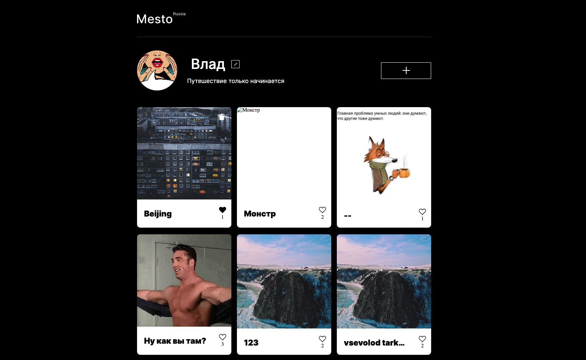
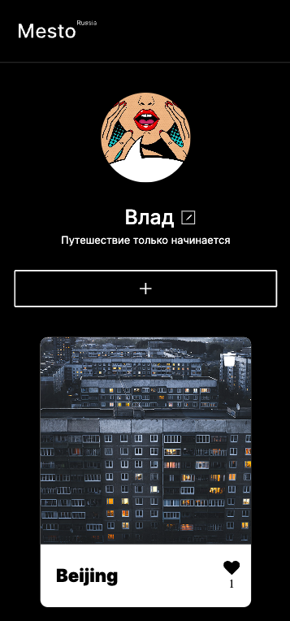

# react-mesto-api-full

## Описание проекта

Учебный проект "Место". На данном этапе сайт полностью переработан и теперь выполнен в связке React + Express.js, полностью с нуля написаны фронтенд и бэкенда

| Desktop | Mobile |
|-------------|-------------|
|||

## Основной функционал

* регистрация и авторизация,
* создание и удаление и карточки,
* просмотр всех загруженных карточек,
* постановка и снятие лайка,
* обновление персональных данных пользователя и аватара,
* открытие фотографии из карточки в полноэкранном режиме.

## Технологии

### Frontend:

* HTML5
* CCS3
* JavaScript (ES6)
* React (Create React App, разметка в JSX, функциональные компоненты и хуки),
* сайт адаптирован под разные расширения экранов,
* flexbox,
* grid,
* БЭМ,
* Webpack.
  
### Backend:

* Node.js,
* mongoDB,
* express.js,
* mongoose,
* celebrate,
* winston - логирование запросов и ошибок.
* Удаленный сервер:
* облачный сервер на Яндекс.Облако,
* домены по которым можно обратиться к API,
* SSL сертификат.
